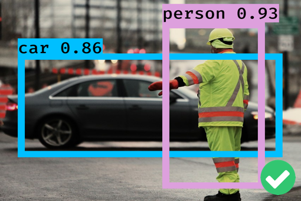
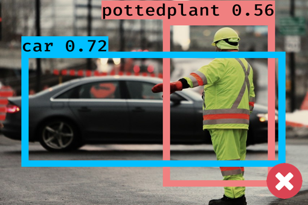
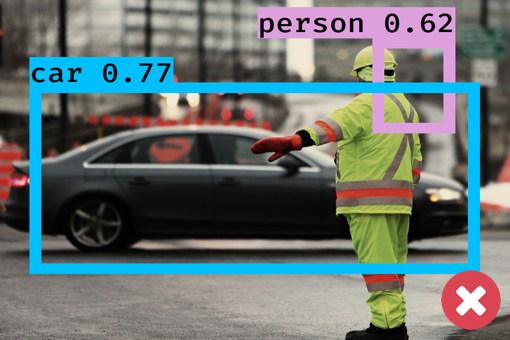
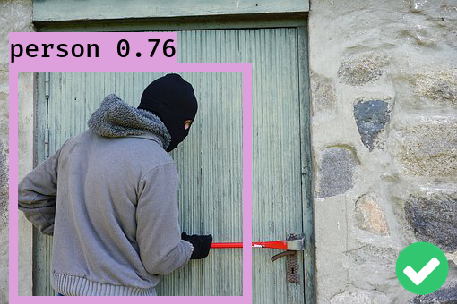
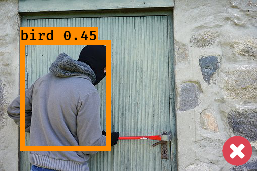
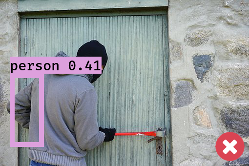

## Introduction
| No Attack | Class-Poison | BBox-Poison | Objn-Poison |
|:---------:|:-------------:|:---------------:|-----------------|
|||||
|||||

Federated learning (FL) enables decentralized training of deep neural networks (DNNs) for object detection over a distributed population of clients. It allows edge clients to keep their data local and only share parameter updates with a federated server. However, the distributed nature of FL also opens doors to new threats. In this project, we present targeted perception poisoning attacks against federated object detection learning in which a subset of malicious clients seeks to poison the federated training of a global object detection model by sharing perception-poisoned local model parameters. They have severe adverse effects only on the objects under attack. In our paper, we analyze the attack feasibility, the impact of malicious client availability, and attack timing. To safeguard FL systems against such contagious threats, we also introduce spatial signature analysis as a defense to separate benign local model parameters from poisoned local model contributions, identify malicious clients, and eliminate their impact on the federated training. Extensive experiments on object detection benchmark datasets validate that the defense-empowered federated object detection learning can improve the robustness against all three types of perception poisoning attacks.


This repository contains the source code for the following papers in our lab:
* Ka-Ho Chow and Ling Liu, "Perception Poisoning Attacks in Federated Learning," IEEE International Conference on Trust, Privacy and Security in Intelligent Systems, and Applications (TPS), Virtual Conference, Dec. 13-15, 2021.

## Installation and Dependencies
This project runs on Python 3.6. You are highly recommended to create a virtual environment to make sure the dependencies do not interfere with your current programming environment. GPUs will be used to accelerate the process of DNN training. 

To install related packages, run the following command in terminal:
```bash
pip install -r requirements.txt
```

## Instruction
The suite of perception poisoning attacks support three types of targeted perception errors:
* Class-Poison: The poisoned global detector misclassifies any object of a victim source class to be a target class with its bounding box and object existence unchanged. 
* BBox-Poison: The poisoned global detector misaligns any object of a victim source class with an incorrect dimension and location while its class label and object existence remain unchanged.
* Objn-Poison: The poisoned global detector is unable to detect any existence of objects of a victim source class.

The current implementation of perception poisoning includes Faster R-CNN, a representation object detection algorithm. Perception poisoning attacks are conducted through dirty-label poisoning, which is model-agnostic and black-box in nature. We will include the implementation of other object detection algorithms (e.g., YOLOv3 and SSD) in the upcoming versions.

To run perception poisoning attacks, run the following command:
```bash
python federated_train.py
```

You can pass arguments to the above file to run benign or poisoned federated object detection with various configurations. The available options can be found by running:
```bash
python federated_train.py -h
```

## Status
We are continuing the development and there is ongoing work in our lab regarding adversarial attacks and defenses on object detection. If you would like to contribute to this project, please contact [Ka-Ho Chow](https://khchow.com). 

The code is provided as is, without warranty or support. If you use our code, please cite:
```
@inproceedings{chow2021perception,
  title={Perception Poisoning Attacks in Federated Learning},
  author={Chow, Ka-Ho and Liu, Ling},
  booktitle={IEEE International Conference on Trust, Privacy and Security in Intelligent Systems, and Applications},
  year={2021},
  organization={IEEE}
}
```

## Acknowledgement
This project is developed based on the following repositories:
* [git-disl/TOG](https://github.com/git-disl/TOG)
* [chenyuntc/simple-faster-rcnn-pytorch](https://github.com/chenyuntc/simple-faster-rcnn-pytorch)
